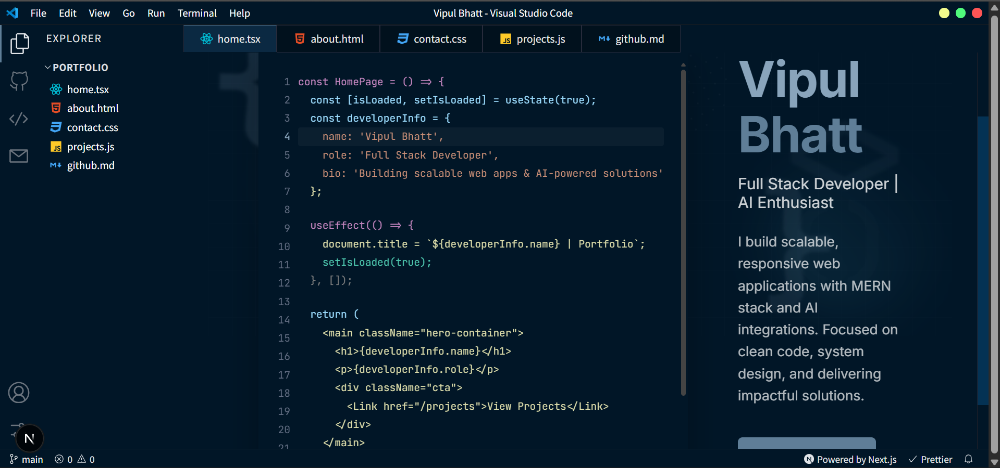
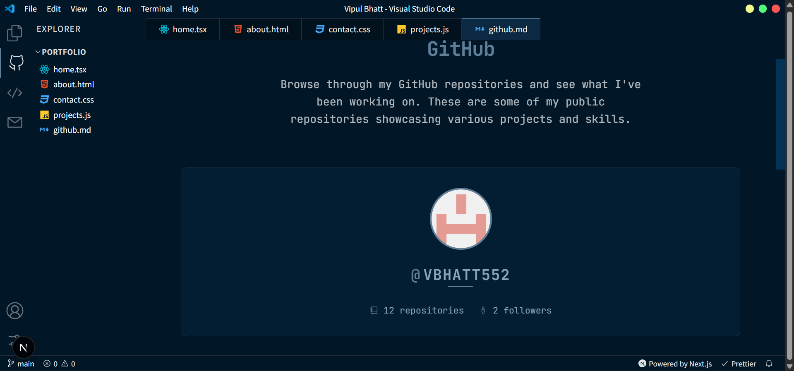

# 🖥️ Vipul Bhatt - Developer Portfolio


A **VSCode-themed developer portfolio** built with **Next.js**, featuring my projects, skills, and experience as a **Full-Stack Developer** specializing in **MERN stack** and **AI-powered applications**.

---

## 📸 Preview



---

## 🚀 Features
- 🖥 **VSCode-inspired UI** – A unique design for developers
- 📄 **Dynamic Pages** – Home, About, Projects, Contact
- 📦 **SEO Optimized** – Meta tags for search engines & social media
- 📱 **Responsive Design** – Mobile-friendly and fast
- 🌗 **Theme Support** – Light/Dark mode with local storage

---

## 🛠 Tech Stack
- **Frontend:** Next.js, React, TypeScript
- **Styling:** CSS Modules (Tailwind optional)
- **Deployment:** Vercel

---

## 🔗 Live Demo
👉 **[View Live Portfolio](https://vipul-portfolio.vercel.app)**

---

## ⚡ Getting Started

### 1️⃣ Clone the Repository
```bash
git clone https://github.com/vbhatt552/portfolio.git
cd portfolio
```
### 2️⃣ Install Dependencies
```
npm install
```

### 3️⃣ Run Development Server
```
npm run dev
```
Visit: http://localhost:3000


## ✅ Deployment

This portfolio is deployed on Vercel:

- Push the repo to GitHub

- Connect it to Vercel

- Vercel auto-builds and deploys the app

## 🏗 Future Improvements

- 🔄 Add animations using Framer Motion

- 📝 Blog section for technical content

- 📊 Advanced SEO (Open Graph, Twitter cards)

- 📄 Resume download button

## 👨‍💻 Author  
**Vipul Bhatt**  
🌐 [Portfolio](https://vipul-portfolio.vercel.app)  
💼 [LinkedIn](https://www.linkedin.com/in/vipul-bhatt-507104250/)  
🐙 [GitHub](https://github.com/vbhatt552)  

---

⭐ **If you like this project, give it a star on GitHub!** ⭐  
